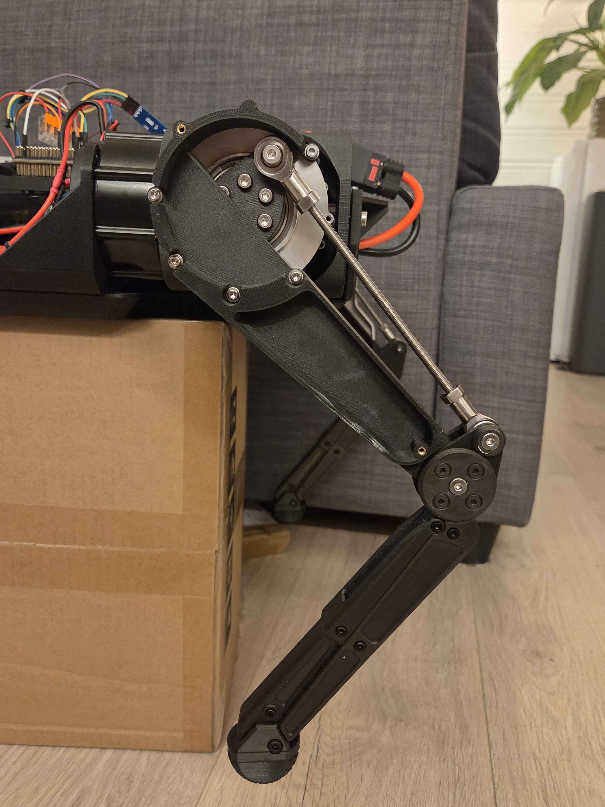

# Custom 12-DOF Quadruped Robot

A personal robotics project built around 12 RobStride actuators and an STM32 controller, with a Jetson / ROS 2 layer planned for higher-level control. The project spans mechanical assembly, power and CAN wiring, embedded C, and motion control.

**Current status:** the robot is assembled and can move between preset poses. I have tested placing it on the ground in its retracted pose, commanding it to stand with the button, and returning it to retracted. Walking and active balance control are still planned.

*Updated: 20 September 2026.*

## Photos and videos



*Leg mechanism with the cover removed.*

[](https://www.youtube.com/watch?v=kTkdTzKSAXw)

*Pose sequence physical test — recorded 20 September 2026.*

## What works so far

- Mechanical assembly, actuator power wiring, and CAN wiring are complete.
- The STM32 communicates with all 12 actuators and reads joint feedback.
- Joint calibration, position limits, and individual-leg and all-leg commands are implemented.
- Button-controlled pose sequencing has been tested on the robot, including standing from retracted and returning to retracted on the ground.

Pose changes currently use a 2 second smooth transition, with joint targets updated at 50 Hz. The firmware sequence is:

```text
Disabled -> Retracted -> Standing -> Retracted -> Resting -> Disabled
```

The BMI088 IMU driver is present, but sensing is not yet integrated into motion control. Motor-health monitoring and feedback timeout handling are the next firmware priorities.

## Hardware

The robot is my original CAD design, with structural parts 3D printed in **PPA-CF**. It currently weighs approximately **15 kg**, putting it in the same weight class as the [Unitree Go2](https://www.unitree.com/mobile/go2/).

| Component | Role |
| --- | --- |
| 12 x RobStride 06 | Three CAN-controlled joints per leg. |
| STM32 NUCLEO-G474RE | Actuator communication and pose control. |
| BMI088 | IMU for future state estimation and stabilization. |
| NVIDIA Jetson Orin Nano Super Developer Kit | Planned ROS 2 and higher-level control. |
| 13S3P Molicel P45B battery pack | Robot power system. |
| OAK-D Pro W | Future perception. |

Each leg has hip abduction/adduction, hip flexion/extension, and knee flexion/extension. The knee actuator sits near the hip and drives the knee through a pushrod.

## Next steps

1. Improve motor-health checks, feedback freshness tracking, and fault handling.
2. Test standing over longer periods and monitor actuator temperatures.
3. Develop leg kinematics and integrate IMU measurements.
4. Add Jetson / ROS 2 communication, gamepad control, and body stabilization.
5. Progress to weight shifting, stepping, and walking. Perception is a longer-term goal.

## Code

The repository currently contains the [STM32CubeIDE firmware project](stm32/quadruped_stm32). Jetson / ROS 2 software is planned.

| File | Purpose |
| --- | --- |
| [main.c](stm32/quadruped_stm32/Core/Src/main.c) | Pose targets, button sequence, motion scheduling, and diagnostics. |
| [robot_joints.c](stm32/quadruped_stm32/Core/Src/robot_joints.c) | Joint calibration, angle conversion, limits, and commands. |
| [robstride_can.c](stm32/quadruped_stm32/Core/Src/robstride_can.c) | Actuator CAN protocol and feedback. |
| [bmi088.c](stm32/quadruped_stm32/Core/Src/bmi088.c) | IMU driver. |
