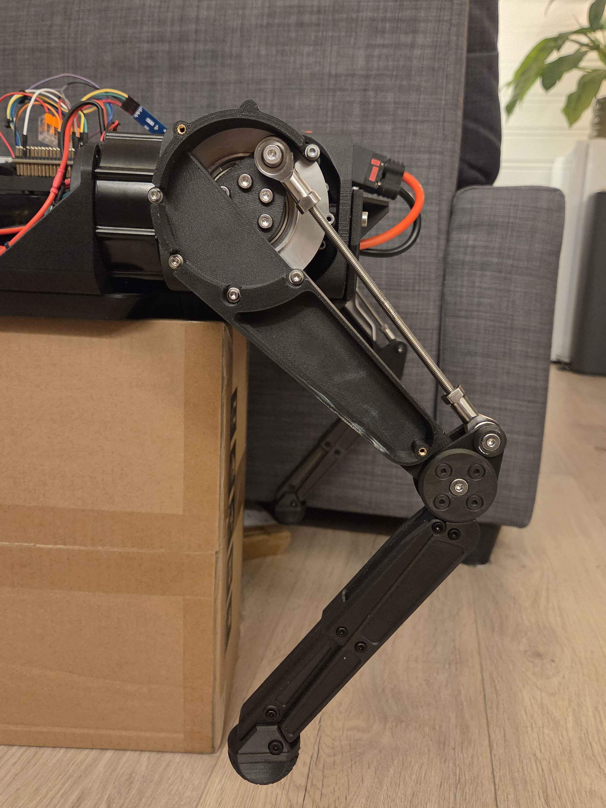
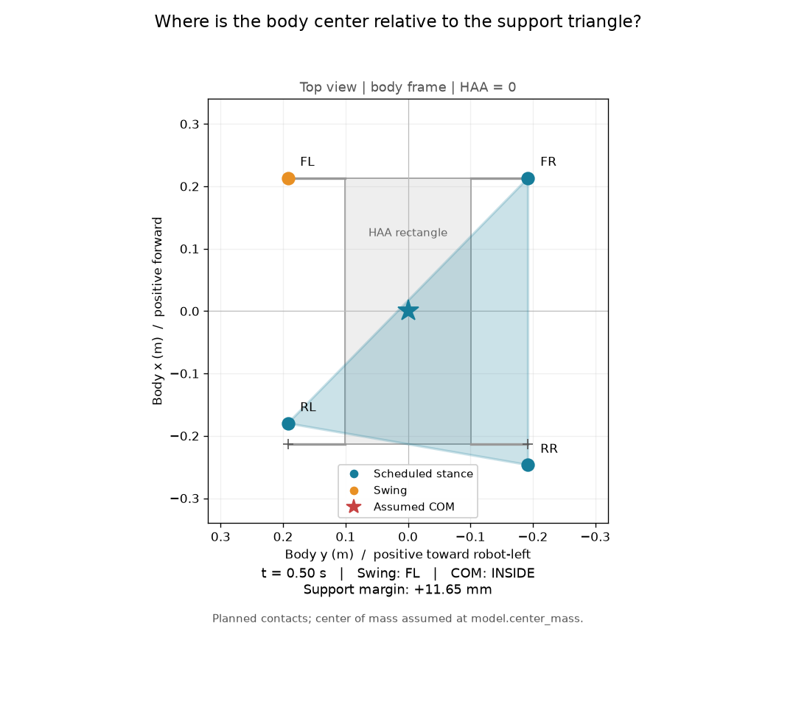

# Custom 12-DOF Quadruped Robot

A personal robotics project covering mechanical design, embedded motor control, and leg kinematics. It uses 12 RobStride actuators and an STM32 controller, with a Jetson / ROS 2 layer planned for higher-level control.

**Current status:** the assembled robot performs button-controlled pose transitions, including standing from a retracted pose on the ground and returning to retracted. A separate Python model now implements planar and 3D leg kinematics, crawl gait timing, and support-triangle analysis. The gait animation is offline; walking and active balance control have not been demonstrated on the robot.

*Updated: 28 September 2026.*

## Photos and videos



*Leg mechanism with the cover removed.*

[](https://www.youtube.com/watch?v=R-0c6qNww3c)

*Pose sequence physical test — recorded 21 September 2026.*

## What works so far

- Mechanical assembly, actuator power wiring, and CAN wiring are complete.
- The STM32 communicates with all 12 actuators and reads joint feedback.
- Joint calibration, position limits, and individual-leg and all-leg commands are implemented.
- Button-controlled pose sequencing has been tested on the robot, including standing from retracted and returning to retracted on the ground.

Pose changes currently use a two-second smooth transition, with joint targets updated at 50 Hz. The firmware sequence is:

```text
Disabled -> Retracted -> Standing -> Retracted -> Resting -> Disabled
```

Motor-health monitoring requests all motors stop on faults, offline motors, or missing/stale feedback. Holding-fault injection and MCU-reset startup stopping have been tested on hardware; feedback freshness and malformed-frame handling have offline tests. The 500 ms freshness timeout is provisional, and stop delivery is not acknowledged.

## Offline kinematics and gait model

- Planar and 3D forward/inverse kinematics, including the lateral HAA offset and mirrored leg geometry.
- Geometric reach checks and shared joint-limit checks.
- Swing/stance trajectories with matching endpoint velocities and four-leg phase offsets.
- Signed support margin and a Matplotlib viewer with pause and a time slider.



*A simulated gait frame: blue feet are scheduled stance contacts; orange is swing. The star is an assumed COM projection. This is a geometric model, not a dynamics simulation or a hardware walking result.*

Run from the repository root (tested with Python 3.14.3 and Matplotlib 3.11.1).
On Windows:

```powershell
python -m venv .venv
.venv\Scripts\python -m pip install -r requirements.txt
.venv\Scripts\python animate_gait.py
```

On macOS/Linux, use `python3` to create the environment and `.venv/bin/python`
for the install/run commands. Run `python leg_kinematics.py` for the text
simulation. The model itself uses only the Python standard library. See
[coordinate conventions and model limits](docs/kinematics.md).

## Verification

Run the offline geometry tests without connecting any hardware:

```sh
python -m unittest discover -s tests -p "test_kinematics.py" -v
```

They cover 3D FK/IK round trips, coordinate transforms, joint/reach boundaries, gait timing, and support margins under different vertex orders.

The firmware regression harness compiles the real CAN/joint modules and runs them with a fake HAL in ARM emulation:

```sh
python -m pip install --target build/test-deps unicorn==2.1.4 pyelftools==0.33
python tests/run_feedback_tests.py --cc /path/to/arm-none-eabi-gcc
```

To build the firmware, import `stm32/quadruped_stm32` as an existing STM32CubeIDE project and build its Debug configuration. Generated build output is excluded from Git. Offline checks do not establish physical stability or motor-stop delivery.

## Hardware

The robot is my original CAD design, with structural parts 3D printed in PPA-CF. It currently weighs approximately 15 kg.

| Component | Role |
| --- | --- |
| 12 x RobStride 06 | Three CAN-controlled joints per leg. |
| STM32 NUCLEO-G474RE | Actuator communication and pose control. |
| BMI088 | IMU for future state estimation and stabilization. |
| NVIDIA Jetson Orin Nano Super Developer Kit | Planned ROS 2 and higher-level control. |
| 13S3P Molicel P45B battery pack | Robot power system. |
| OAK-D Pro W | Future perception. |

Each leg has hip abduction/adduction, hip flexion/extension, and knee flexion/extension. The knee actuator sits near the hip and drives the knee through a pushrod.

## Next steps

1. Connect world/body/leg transforms to 3D IK for body movement with planted feet.
2. Plan body shifts with positive support clearance and validate the model against physical joint conventions.
3. Complete the remaining feedback-health checks and test standing duration/temperatures.
4. Integrate BMI088 measurements for orientation estimation and body leveling.
5. Progress to stepping and walking with feedback, then Jetson / ROS 2 and gamepad control. Perception is a longer-term goal.

## Code

The repository contains the [STM32CubeIDE firmware project](stm32/quadruped_stm32) and offline Python experiments. Jetson / ROS 2 software is planned. The BMI088 driver exists, but its measurements are not yet integrated into motion control.

| File | Purpose |
| --- | --- |
| [main.c](stm32/quadruped_stm32/Core/Src/main.c) | Pose targets, button sequence, motion scheduling, and diagnostics. |
| [robot_joints.c](stm32/quadruped_stm32/Core/Src/robot_joints.c) | Joint calibration, angle conversion, limits, and commands. |
| [robstride_can.c](stm32/quadruped_stm32/Core/Src/robstride_can.c) | Actuator CAN protocol and feedback. |
| [bmi088.c](stm32/quadruped_stm32/Core/Src/bmi088.c) | IMU driver. |
| [leg_kinematics.py](leg_kinematics.py) | Leg geometry, coordinate transforms, gait trajectories, and support margin. |
| [animate_gait.py](animate_gait.py) | Offline top-down gait viewer. |
| [tests/](tests/) | Python geometry tests and firmware feedback regression harness. |
